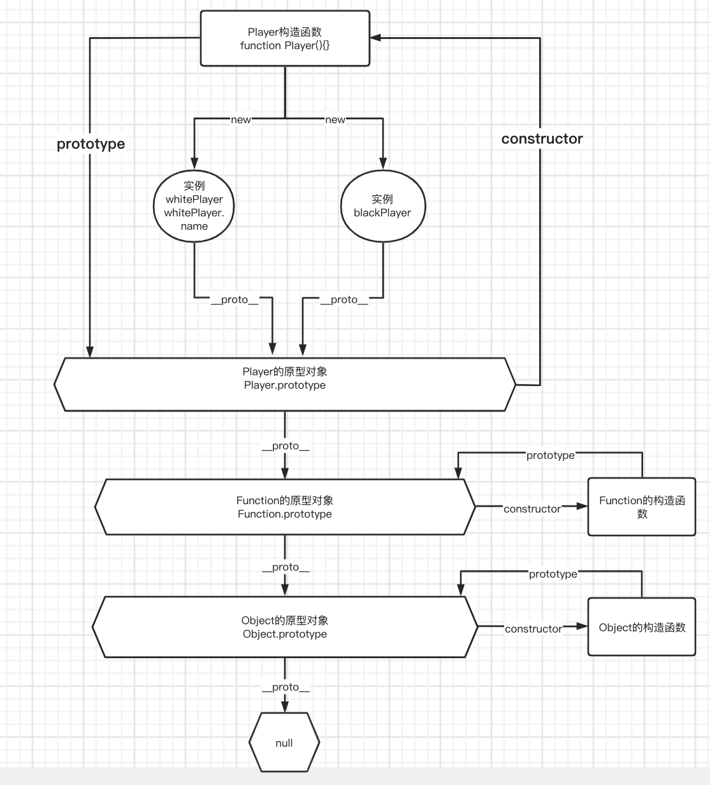

# 原型及原型链

## 在原型上添加属性或者方法有什么好处？

刚才已经说过了，如果不通过原型的方式，每生成一个新对象，都会在内存中新开辟一块存储空间，当对象变多之后，性能会变得很差。

但是通过

```javascript
Player.prototype.xx = function () {};
Player.prototype.xx = function () {};
Player.prototype.xx = function () {};
```

这种方式向原型对象添加属性或者方法的话，又显得非常麻烦。所以我们可以这样写

```javascript
Player.prototype = {
  start: function () {
    console.log("下棋");
  },
  revert: function () {
    console.log("悔棋");
  },
};
```

## 怎么找到 Player 的原型对象？

```javascript
function Player(color) {
  this.color = color;
}

Player.prototype.start = function () {
  console.log(color + "下棋");
};

const whitePlayer = new Player("white");
const blackPlayer = new Player("black");

console.log(blackPlayer.__proto__); // Player {}
console.log(Object.getPrototypeOf(blackPlayer)); // Player {}，可以通过Object.getPrototypeOf来获取__proto__
console.log(Player.prototype); // Player {}
console.log(Player.__proto__); // [Function]
```

可以看一下 prototype.png 原型的流程图 


## 那么 new 关键字做了什么就很明了了

1. 一个继承自 Player.prototype 的新对象 whitePlayer 被创建
2. whitePlayer.**proto** 指向 Player.prototype，即 whitePlayer.**proto** = Player.prototype
3. 将 this 指向新创建的对象 whitePlayer
4. 返回新对象
   4.1 如果构造函数没有显式返回值，则返回 this
   4.2 如果构造函数有显式返回值，是基本类型，比如 number,string,boolean, 那么还是返回 this
   4.3 如果构造函数有显式返回值，是对象类型，比如{ a: 1 }, 则返回这个对象{ a: 1 }

后面看一下怎么手写实现 new 函数

```javascript
// 1. 用new Object() 的方式新建了一个对象 obj
// 2. 取出第一个参数，就是我们要传入的构造函数。此外因为 shift 会修改原数组，所以 arguments 会被去除第一个参数
// 3. 将 obj 的原型指向构造函数，这样 obj 就可以访问到构造函数原型中的属性
// 4. 使用 apply，改变构造函数 this 的指向到新建的对象，这样 obj 就可以访问到构造函数中的属性
// 5. 返回 obj
function objectFactory() {
  let obj = new Object();
  let Constructor = [].shift.call(arguments);
  obj.__proto__ = Constructor.prototype;
  let ret = Constructor.apply(obj, arguments);
  return typeof ret === "object" ? ret : obj;
}
```

## 原型链又是什么呢？

我们都知道当读取实例的属性时，如果找不到，就会查找与对象关联的原型中的属性，如果还查不到，就去找原型的原型，一直找到最顶层为止。

举个例子

```javascript
function Player() {}

Player.prototype.name = "Kevin";

var p1 = new Player();

p1.name = "Daisy";
// 查找p1对象中的name属性，因为上面添加了name，所以会输出“Daisy”
console.log(p1.name); // Daisy

delete p1.name;
// 删除了p1.name，然后查找p1发现没有name属性，就会从p1的原型p1.__proto__中去找，也就是Player.prototype，然后找到了name，输出"Kevin"
console.log(p1.name); // Kevin
```

那如果我们在 Player.prototype 中也找不到 name 属性呢,那么就会去 Player.prototype.**proto**中去寻找。

```javascript
Object.prototype.name = "root";

function Player() {}

Player.prototype.name = "Kevin";

var p1 = new Player();

p1.name = "Daisy";
// 查找p1对象中的name属性，因为上面添加了name，所以会输出“Daisy”
console.log(p1.name); // Daisy

delete p1.name;
// 删除了p1.name，然后查找p1发现没有name属性，就会从p1的原型p1.__proto__中去找，也就是Player.prototype，然后找到了name，输出"Kevin"
console.log(p1.name); // Kevin

delete Player.prototype.name;

console.log(p1.name);
```

这样一条通过**proto**和 prototype 去连接的对象的链条，就是原型链