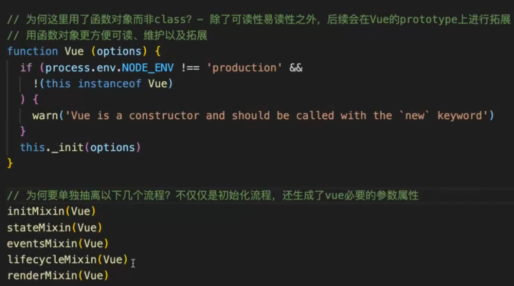

###  什么是mvvm
#### 面试题1：mvvm的原理或者核心模式，观察模式的实现，如何实现响应式

### Vue的目录结构

1.compliler：编译相关
runtime only  or  runtime+compliler区别
2.core：vue核心代码
3.platforms：跨平台代码
4.server：服务端渲染
5.sfc：.vue文件的解析器
6.shared：共享工具方法

#### 面试题2：template和render分别怎么编译生成实际dom   =>renderFunction compliler有专门的部分优化template 绕过template会跳过优化步骤

beforeCreated created 之前做了什么

props data怎么挂载在vm上的 proxy
initProps initData

vm.$options  为什么data是函数 而components是对象
             data函数没返回值会报错吗
              